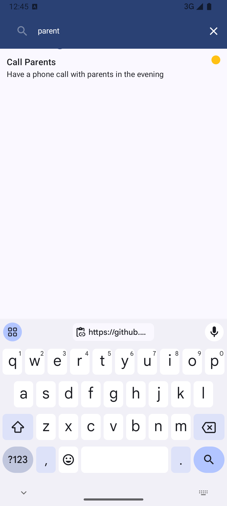

# AppTodo - Task Management Application with Jetpack Compose

This project is a task management application built using modern Android development tools. It leverages Jetpack Compose, MVVM architecture, and other popular Android components to provide a clean, responsive, and efficient user experience.

## Features
- **Task Creation and Editing**: Users can create and update tasks.
- **Task List**: Displays a list of existing tasks.
- **Task Prioritization**: Allows users to set priority levels for tasks.
- **Splash Screen**: Displayed when the app is launched.
- **Navigation**: Smooth navigation between destinations using Jetpack Navigation.

## Technologies and Libraries Used
- **Jetpack Compose**: Modern UI development toolkit for Android.
- **Kotlin**: Primary programming language.
- **MVVM (Model-View-ViewModel)**: Clean and maintainable architecture.
- **Navigation Component**: For handling navigation within the app.
- **Room Database**: Local data storage solution.
- **Hilt (Dependency Injection)**: For dependency injection and management.
- **Coroutines**: For asynchronous operations.
- **State Management**: Managed using ViewModel and LiveData.
- **DataStore**: For storing user preferences and application settings.

## Project Structure

- **components**: Reusable UI components such as dialogs and dropdown menus.
- **data**: Handles database models, repository layers, and data storage.
  - **models**: Application models.
  - **repositories**: Repository layer for database interactions.
- **di**: Dependency Injection modules.
- **navigation**: Manages destinations and in-app navigation.
- **ui**: User interface components including screens (Lists, Tasks, Splash).
- **util**: Utility classes and constants.

## Application Screenshots

| Add Task | Task List | Search Task | Update Task |
| --- | --- | --- | --- |
|  |  |  |  |

## Installation and Setup

1. Clone the repository:
   ```bash
   git clone https://github.com/alidumanyp/AppTodo.git
